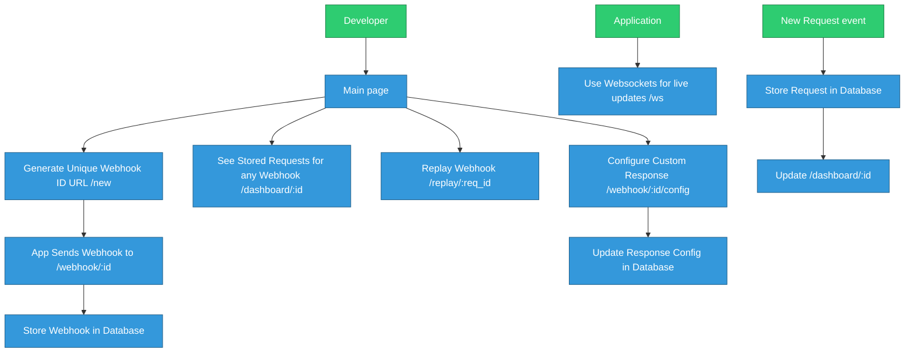

```mermaid
flowchart TD

A[Developer] --> B[Main page]

B --> C[Generate Unique Webhook ID URL /new]
C --> D[App Sends Webhook to /webhook/:id]
D --> E[Store Webhook in Database]

B --> F[See Stored Requests for any Webhook /dashboard/:id]

B --> G[Replay Webhook /replay/:req_id]


B --> H[Configure Custom Response /webhook/:id/config]
H --> I[Update Response Config in Database]

J[Application] --> K[Use Websockets for live updates /ws]

L[New Request event] --> M[Store Request in Database]
M --> N[Update /dashboard/:id]
    
style A fill:#2ecc71,stroke:#1e8449,color:#fff
style B fill:#3498db,stroke:#21618c,color:#fff
style C fill:#3498db,stroke:#21618c,color:#fff
style D fill:#3498db,stroke:#21618c,color:#fff
style E fill:#3498db,stroke:#21618c,color:#fff
style F fill:#3498db,stroke:#21618c,color:#fff
style G fill:#3498db,stroke:#21618c,color:#fff
style H fill:#3498db,stroke:#21618c,color:#fff
style I fill:#3498db,stroke:#21618c,color:#fff
style J fill:#2ecc71,stroke:#1e8449,color:#fff
style K fill:#3498db,stroke:#21618c,color:#fff
style L fill:#2ecc71,stroke:#1e8449,color:#fff
style M fill:#3498db,stroke:#21618c,color:#fff
style N fill:#3498db,stroke:#21618c,color:#fff
```
